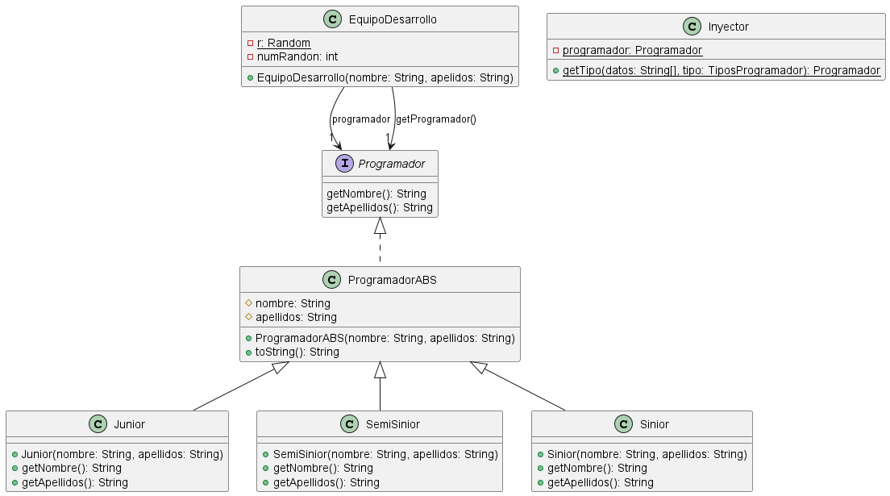

#Polimorfismo
Es la creación de clases a partir de una clase padre la cual será la que nos modele, pero no defina los comportamientos que las clases hijas podrán tomar y gracias a esto las clases hijas pueden ser tratados como la clase padre es decir se define una variable del tipo del padre, pero se crea el objeto tomando la forma de hijo.  
## Modelado UML
La representación en el diagrama que se puede ver en la parte de abajo nos indica que debemos crear una variable de clase que va hacer de tipo privado que es del mismo tipo y el constructor se debe crear de tipo privado de igual forma y por último se crea el método getInstancia() el cual va hace de tipo público y este método lo que nos debe devolver es el objeto.

<p align="center">
  
  </p>

## Implementacion en Java
```java

import java.util.Random;

public class Principal {
	public static enum Tipos {
		JUNIOR, SEMISENIOR, SINIOR
	};

	public static void main(String[] args) {
		Random r = new Random();
		Programador programador = null;
		String[] Datos = { "Jose", "Hernandez Lopéz" };
		int nunRandon = r.nextInt(Tipos.values().length);
		switch (Tipos.values()[nunRandon]) {
		case JUNIOR: {
			programador = new Junior(Datos[0], Datos[1]);
			break;
		}
		case SEMISENIOR: {
			programador = new SemiSinior(Datos[0], Datos[1]);
			break;
		}
		case SINIOR: {
			programador = new Sinior(Datos[0], Datos[1]);
		}
		}
		
		System.out.println(programador);

	}

}
```
Como podemos observar tratamos a la variable como un objeto de la clase programador pero no sabemos la forma del objeto que va a tomar así que cada que se ejecute el programa se va a generar un objeto totalmente diferente.