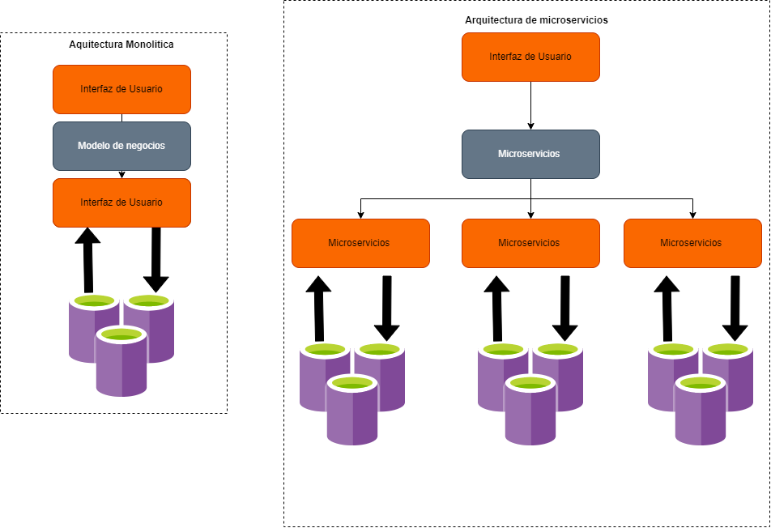

# Tipos de Arquitectura

## Monolitica

La arquitectura monolítica en el desarrollo de software contiene todas las funcionalidades de una aplicación en un único módulo o conjunto de módulos. En este arquitectura, todas las partes de la aplicación están ampliamente relacionadas y se ejecutan en el mismo proceso. Esto puede hacer que sea más fácil desarrollar y probar la aplicación, pero también puede dificultar su escalabilidad y mantenimiento a medida que la aplicación crece en complejidad.

## Microservicios

La arquitectura de microservicios la aplicación se divide en un conjunto de servicios pequeños y autónomos ya que cada uno se encarga de una tarea específica. Cada servicio que se  desarrolla, se prueba y se mantiene de manera independiente, lo que permite un mayor grado de flexibilidad, escalabilidad y hace mas facil el  mantenimiento. Los servicios se comunican entre sí a través de una interfaz establecida, como una API, y pueden ser desplegados en diferentes máquinas o contenedores. El desarrollo y la implementación de una arquitectura de microservicios requiere una gran cantidad de planificación y un cambio en la cultura de desarrollo en comparación con la arquitectura monolítica.

## Diagrama de las Arquitecturas 

  
 

