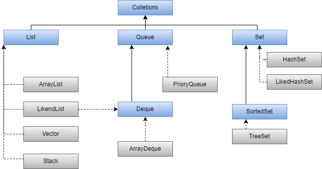
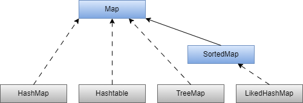

# Colletions

  

### Clases que implementan la interfaz List son

- **ArrayList**: esta es una implementación dinámica que utiliza un arreglo interno para almacenar los elementos ero es lenta pra insertar o eliminar elementos.

- **LinkedList**: esta utiliza una lista enlazada para almacenar los elementos. Es más eficiente para insertar y eliminar elementos.

- **Vector**:  eta es muy similar a ArrayList, pero es sincronizada y segura para ser utilizada en un entorno multi-hilo.

- **Stack**: es una implementación de pila  que proporciona un comportamiento LIFO (Last In First Out)

### Clases que implementan la interfaz Queue son

- **PriorityQueue**: es una implementación ordena los elementos según su orden natural o mediante un comparador específico. Es útil para tareas de planificación y ordenamiento.

- **ArrayDeque**: es una implementación de cola de doble enlazada que utiliza un arreglo interno para almacenar los elementos. Es muy eficiente para insertar y eliminar elementos en ambos extremos, pero es un poco menos eficiente para acceder y recorrer elementos.

- **LinkedList**: también puede ser utilizada como una implementación de cola, proporciona un comportamiento FIFO (First In First Out)

### Clases que implementan la interfaz Set son

- **HashSet**: se basado en una tabla hash, que proporciona un acceso rápido a los elementos y no garantiza el orden de los elementos.

- **TreeSet**: se basa en un árbol, que ordena los elementos según su orden natural o mediante un comparador específico. Es útil para tareas de ordenamiento y búsqueda.

- **LinkedHashSet**: se basada en una tabla hash y una lista enlazada, que mantiene el orden de inserción de los elementos.

# MAP

  

### Clases que implementan la interfaz map son

- **HashMap**: se basada en una tabla hash, que proporciona un acceso rápido a los elementos y no garantiza el orden de los elementos.

- **LinkedHashMap**: se basada en una tabla hash y una lista enlazada, que mantiene el orden de inserción de las claves.

- **Hashtable**:  almacena pares clave-valor, y no permite claves ni valores nulos.

- **TreeMap**: se basada en un árbol, que ordena las claves según su orden natural o mediante un comparador específico. Es útil para tareas de ordenamiento y búsqueda
