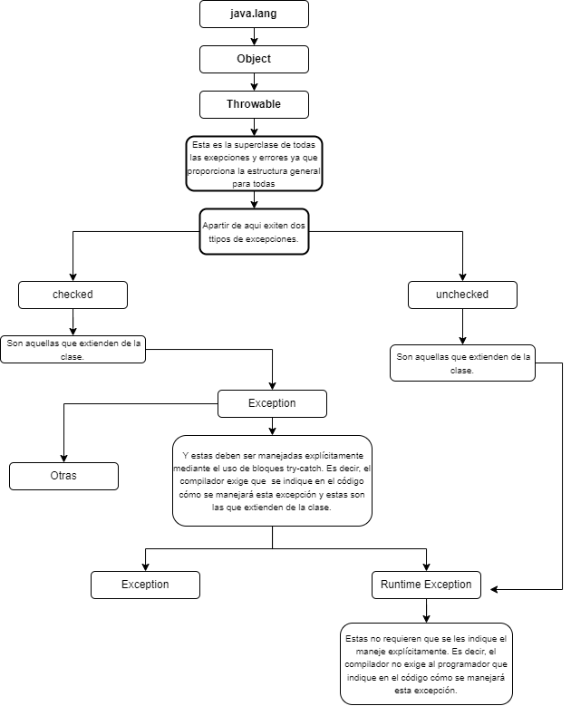

# Exepciones
Acontinuacion se muestra un pequeño diagrama donde se explican un poco de las exepciones

<p align="center">
  
</p>


## Multicatch
Nos permite a un solo bloque catch atrapar varios tipos de excepciones ya que en lugar de tener varios bloques catch separados para cachar cada tipo de excepción, se puede utilizar un solo bloque catch para cachar varios tipos de excepciones. Esto hace que el código sea más limpio y fácil de mantener, ya que se evita la repetición de código.
### Ejemplo
```java
try {
   int num1 = Integer.parseInt("abc");
   int num2 = Integer.parseInt("123");
   int result = num1 / num2;
} catch (NumberFormatException | ArithmeticException ex) {
   System.out.println("Ocurrió un error al calcular el resultado: " + ex.getMessage());
}
```
En este ejemplo, el código intenta convertir una cadena en un entero utilizando el método Integer.parseInt(). Si la cadena no es un número válido, se lanzará una NumberFormatException. Si se intenta realizar una división por cero, se lanzará una ArithmeticException. En lugar de tener dos bloques catch separados para atrapar cada tipo de excepción, se utiliza un solo bloque catch para cachar ambos tipos de excepciones, lo que hace que el código sea más limpio y fácil de mantener.

## Try-with-resources
Nos permite que se liberar automáticamente  recursos (como archivos o conexiones a bases de datos) una vez que se han utilizado en un bloque try. Esto ayuda a evitar errores comunes relacionados con la falta de liberación de recursos y hace que el código sea más limpio y fácil de mantener pero cabe mencionar que solo podran las clases ue implementan la interfaz AutoCloseable.
Un ejemplo en codigo es:
```java
try (Connection conn = DriverManager.getConnection(DB_URL, USER, PASS)) {
   Statement stmt = conn.createStatement();
   ResultSet rs = stmt.executeQuery("SELECT id, name FROM empleados");
   while (rs.next()) {
       System.out.println(rs.getInt("id") + " " + rs.getString("nombre"));
   }
} catch (SQLException e) {
    e.printStackTrace();
}
```