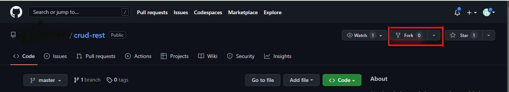
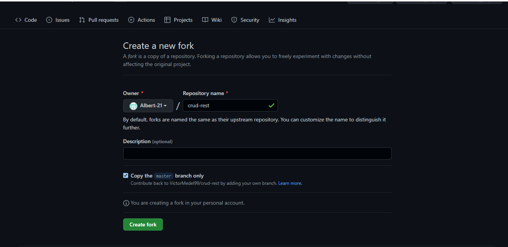

## Pull Request
Un pull request es una solicitud para aceptar de cambios a un repositorio esto con el fin de que estos cambios sean revisados por los colaboradores una vez revisado y una vez a probado los cambios estos se integran a la rama principal del proyecto.
Normalmente incluye una descripción detallada de los cambios propuestos, una discusión sobre los mismos y puede incluir comentarios y sugerencias de quien lo revisa.  

### Comandos en consola
Primero se nececita crear un fork desde el repositorio para esto nos vamos a nuesto GitHub y lo ubicamos y le damos clic en la parte de fork

Una vez hecho nos mostrará la siguiente pantalla y le daremos en crear nuevo fork

Hecho lo anterior clonamos el repositorio como normalmente se hace con 

`git clone https://github.com/usuario/nombre-repositorio.git`

Cree una rama para sus cambios: 

`git checkout -b nombre-de-la-rama`

Realice los cambios en su rama local que se creo y guarde los cambios con lo siguientes comandos.

`git add .`

`git commit -m "Descripción de los cambios realizados `

Por último se suben los cambios a la rama remota con 

`git push origin nombre-de-la-rama`

Una vez hocho eso nos vamos a GitHub y buscamos lo siguiente la opcion de pull request y le damos clic

Hecho lo siguiente los aparecera lo siguiente rellenamos los campos y damos en crear el pull request  

## Fork

Un fork en Git es una copia de un repositorio que se almacena en la cuenta de un usuario en GitHub. Al hacer un fork, se crea una copia exacta del repositorio original, incluidos todos los archivos y el historial de commits, en su propia cuenta de GitHub y esto se puede unicamente en la plataforma de GitHub

Una vez en GitHub nos vamos en donde dice fork

Una vez hecho nos mostrará la siguiente pantalla y le daremos en crear nuevo fork

Hecho lo anterior clonamos el repositorio como normalmente se hace con

`git clone https://github.com/usuario/nombre-repositorio.git`

Y con todo esto podemos empezar a trabajar en nuestro repositorio

## Reabase

Rebase se utiliza para integrar los cambios de una rama en la rama base. En lugar de crear un merge, que combina dos ramas y crea un nuevo commit, el rebase toma los cambios de una rama y los aplica sobre la rama base. Esto hace que la rama base parezca haber sido actualizada directamente con los cambios de la otra rama, en lugar de combinar dos versiones diferentes del código. 

El rebase es útil para mantener de forma lineal de la historia de un repositorio y evitar la creación de ramas de merge innecesarias. Sin embargo, también puede ser peligroso si se realiza incorrectamente, ya que puede sobrescribir los cambios existentes en la rama base y causar conflictos difíciles de resolver. Por lo tanto, es importante utilizar el rebase con cuidado y solo en ramas que no han sido compartidas con otros desarrolladores

Para esto se necesita pasar a la rama base

`git checkout nombre-de-la-rama-base`

Después se ejecuta 

`git rebase nombre-de-la-rama-a-combinar`

Y eso seria todo
## Stack

Permite guardar temporalmente cambios en el repositorio sin hacer un commit. Es útil cuando se está trabajando en una serie de cambios y desea cambiar temporalmente a otra rama para resolver un conflicto o realizar otra tarea, pero no desea hacer un commit de los cambios actuales.

Esto se hace con 

`git stash save` para guardar los cambios

`git stash apply` para recuperar los cambios 

`git stash list` para ver una lista de los cambios

`git stash show stash@{indce}` para ver detalles de un cambio específico

`git stash drop stash@{indce}` para eliminar de un cambio específico

## Clean 
Se usa para eliminar archivos no rastreados en el repositorio. Los archivos no rastreados son aquellos que no están incluidos en el último commit y que no han sido agregados al índice de Git mediante el comando ``git add``.

El comando ``git clean`` se utiliza para eliminar archivos y directorios no rastreados. Por defecto, ``git clean`` solo elimina archivos simples, pero puede usarse con la opción -d para eliminar también los directorios vacíos y -f para forzar la eiminación sin confirmación.

Es importante tener en cuenta que los archivos eliminados mediante ``git clean`` no se pueden recuperar. Por lo tanto, antes de usar el comando, asegúrese de que los archivos que desea eliminar sean realmente archivos no deseados o temporales.

